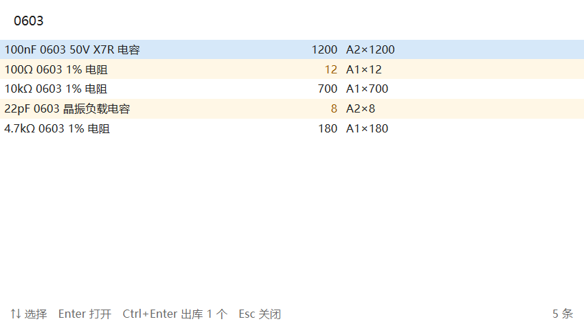
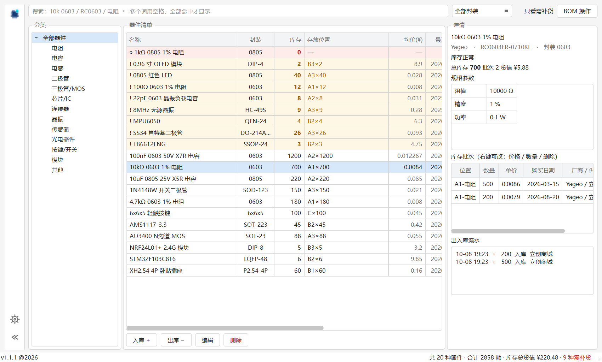
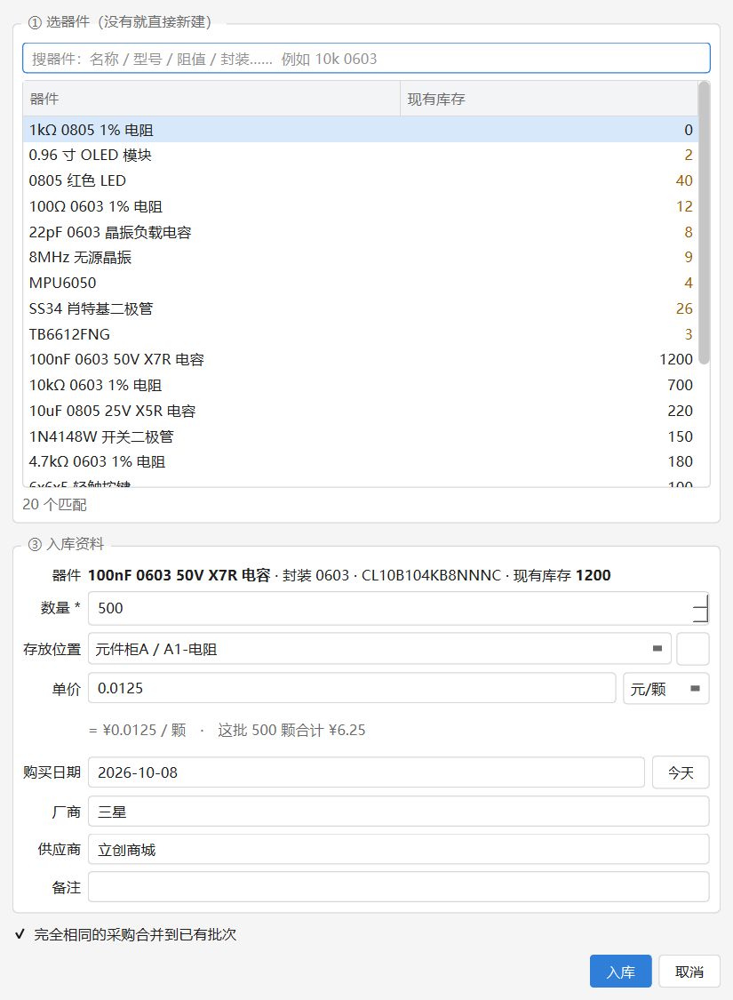
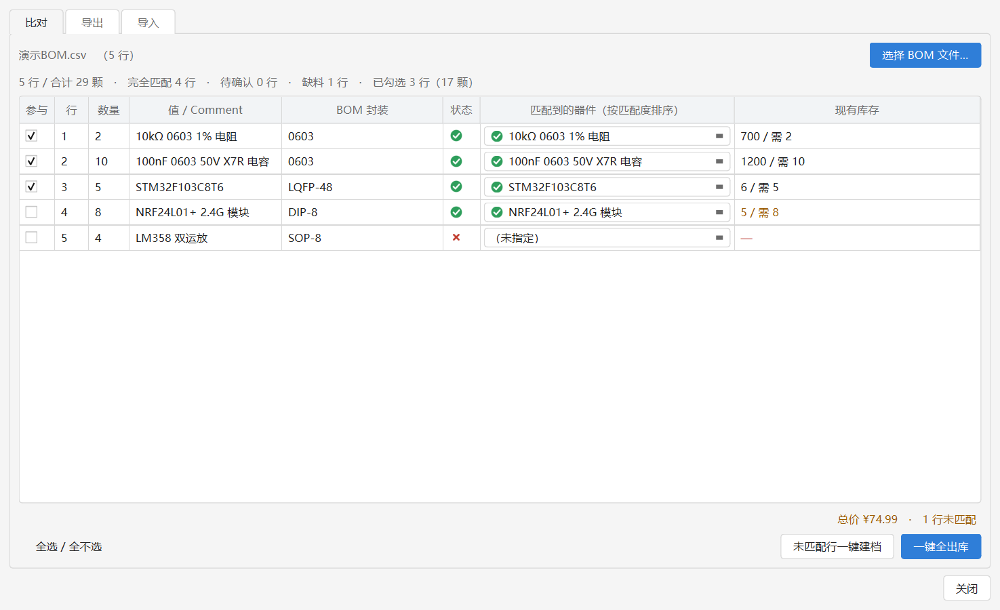
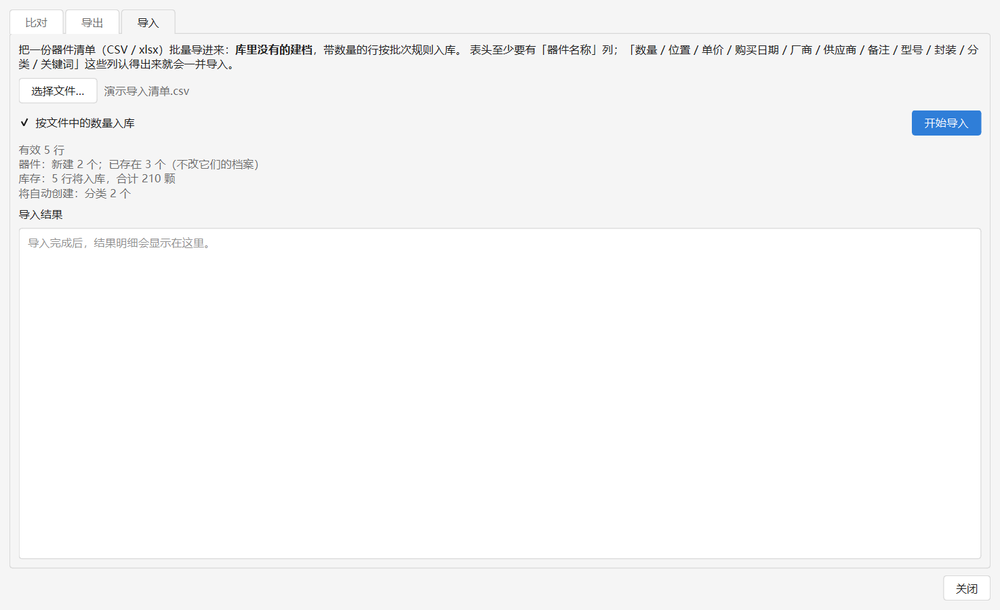
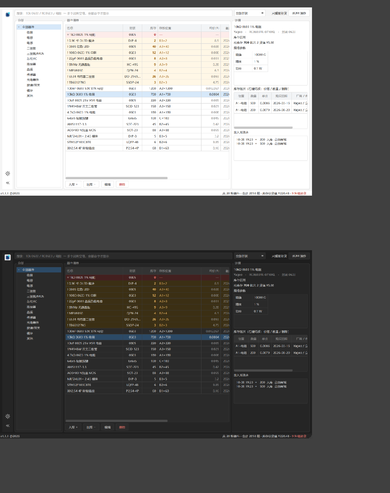

<div align="center">


# EDMS

### 轻量、完全本地的电子元器件库存管理工具

**A Fully Local Electronic Component Inventory Manager for Windows 10 / 11**

[](https://github.com/silvance7/EDMS/releases)
[]
[](https://www.python.org/)
[](https://www.qt.io/)
[]
[]
[](LICENSE)

<br/>

[📖 简介](#intro) • [✨ 功能特性](#features) • [🚀 快速开始](#quickstart) • [🛠️ 构建与开发](#build) • [📂 项目结构](#structure) • [💡 开发故事](#story) • [📄 许可证](#license)

</div>

---

## <a id="intro"></a>📖 简介

**EDMS** 是一款面向个人电子制作场景的元器件库存管理工具，**完全本地运行、不需要联网、不依赖任何服务端**。

核心场景只有一个：**画 PCB 时按下热键，几秒内知道某个器件有没有、有几个、在哪个抽屉。**

托盘常驻、全局热键唤起浮窗、实时检索；入库 / 出库记录到*批次*级别（数量、单价、购买日期、厂商、供应商），并附带 BOM 的比对、成本估算、一键出库与清单导出 / 导入。

> 💡 **设计重点**：
> - **完全本地**：数据就是一个 SQLite 单文件（`data/inventory.db`），复制即备份；程序全程不发起任何网络请求；
> - **轻量常驻**：纯托盘常驻内存约 **64 MB**、冷启动约 **44 ms**（开发机实测，见下表）；
> - **录入顺手**：入库面板搜不到器件可现场建档；价格按报价单位输入自动换算；同批次自动合并，连续录入不产生重复记录。

### 性能实测

以下为开发机实测数据（Windows / Python 3.13 / PySide6 6.9.1），非估算值：

| 状态 | 数值 | 说明 |
| :--- | :--- | :--- |
| 冷启动到托盘就绪 | **44 ms** | 含建库、迁移、注册全局热键 |
| 纯托盘常驻内存 | **64 MB** | 日常使用中的状态 |
| 主窗口打开后 | 140 MB | 按需加载，关闭后回落 |
| 打包产物 | 62 MB | 绿色便携版，含全部运行时 |
| 数据库体积 | 140 KB | 20 个器件 / 21 个批次 |

> 64 MB 不是天然如此：快速查询浮窗最初在启动时构造，常驻内存 118 MB；改为**首次按热键时才构造**后降到 64 MB。主窗口同样懒加载 —— 常驻进程里不含任何「可能用不到」的界面对象。

---

## <a id="features"></a>✨ 功能特性

### 1. ⚡ 全局热键与快速查询

按下 **`Ctrl + Alt + E`** 随时唤出检索浮窗，输入几个字即时出结果，`Enter` 打开主窗口、`Ctrl + Enter` 直接快速出库 1 个。

| 按键 | 作用 |
| :--- | :--- |
| `Ctrl + Alt + E` | 唤出 / 收起快速查询浮窗 |
| 输入框打字 | 实时检索，多个词用空格分开（全部命中才显示） |
| `↑` `↓` | 选择结果 |
| `Enter` | 打开主窗口并定位到该器件 |
| `Ctrl + Enter` | **快速出库 1 个**（直接扣减并记流水） |
| `Esc` | 关闭浮窗 |

左键单击托盘图标 = 快速查询，双击 = 打开主窗口；检索为**多词 AND**，数值带 SI 前缀展开（打 `10k` 能搜到存着 `10000 Ω` 的电阻，打 `100n` 能找到 `100 nF` 的电容）。

<div align="center">
  
</div>

<details>
<summary><b>🔧 热键被占用怎么办</b></summary>
<br/>

Windows 上 `Ctrl+Alt+字母` 这类组合容易被其它程序抢占（输入法、显卡驱动、截图工具都是惯犯），因此程序内置自动降级、不会因为热键冲突而罢工：

1. 先试 `data/settings.json` 里配置的 `hotkey`（默认 `ctrl+alt+e`，E 取 Element / 元件）；
2. 失败则按内置候选链依次尝试：`ctrl+alt+e` → `ctrl+alt+q` → `ctrl+alt+d` → `ctrl+alt+w` → `ctrl+alt+j`（与已配置组合相同的一档会跳过）；
3. 降级成功后**托盘弹气泡提示实际生效的组合**；
4. 全部被占用时停用热键并给出提示，此时仍可点击托盘图标唤起快速查询。

**改热键**：打开主窗口左侧边栏的「设置 → 常规 → 全局热键」，直接按下想用的组合（如 `Ctrl+Shift+F9`）再点「应用」，**立即生效**（注册失败会提示并保留原热键）；
也可以手改 `data/settings.json` 的 `hotkey` 字段（格式如 `ctrl+shift+f9`，大小写随意）——
修饰键支持 `ctrl` / `alt` / `shift` / `win`，主键支持字母、数字、`F1`-`F24`，以及 `space` / `tab` / 方向键等常见名称。

**检测某个组合是否被占用**：直接尝试注册一次最可靠，失败且错误码为 `1409`（`ERROR_HOTKEY_ALREADY_REGISTERED`）即代表已被其它程序注册：

```python
import ctypes

MOD_ALT, MOD_CONTROL, MOD_NOREPEAT = 0x1, 0x2, 0x4000
user32 = ctypes.windll.user32
kernel32 = ctypes.windll.kernel32

kernel32.SetLastError(0)
ok = user32.RegisterHotKey(None, 99, MOD_CONTROL | MOD_ALT | MOD_NOREPEAT, ord("E"))
print("空闲" if ok else f"被占用，错误码 {kernel32.GetLastError()}")   # 1409 = 已被注册
if ok:
    user32.UnregisterHotKey(None, 99)   # 测完记得释放，否则等于自己把它占上了
```

</details>

---

### 2. 🗂️ 两级库存与批次管理

数据模型以**器件**与**批次**两级组织，这是整套设计的地基：

```text
part（物料主数据）        一个「10kΩ 0603 1% 电阻」就是一条 part 记录
  └─ stock_lot（库存批次）  同一颗器件可以在多个位置各存一批
                            每批的数量 / 单价 / 购买日期 / 厂商 / 供应商独立记录
                            总库存 = SUM(stock_lot.quantity)
```

**价格与购买日期属于「这一次采购」而非器件本身**——3 月买的一批 1 分钱一颗、9 月买的 1 分 2，不拆批次就记不下来；同一器件也常常一半散料、一半整盘，拆开才能看到完整的位置分布。

**厂商（生产商）同样记录在批次上**：同一个 10kΩ 电阻，不同厂牌属于同一条器件记录的两条采购批次，更换厂牌无需新建器件。

主界面 = **左侧图标栏**（折叠「分类」面板、打开「设置」）+ 分类树 / 器件表格 / 详情面板三栏：表格中缺货标红、低库存标黄，详情面板展示规格参数、库存批次（可右键修正价格 / 盘点 / 删除）与出入库流水；未分类的器件集中显示在树上的「未分类」节点里，随时可归置；状态栏左侧常驻版本号（`v1.1.1 @2026`）。分类节点右键可新建子分类、重命名、删除，以及**增删该分类的规格参数**。

<div align="center">
  
</div>

---

### 3. 📥 入库 / 出库

**入库面板不要求先在表格里选器件**：面板顶部即搜索框，搜到直接选中；搜不到就点「＋ 新建器件」打开完整器件表单（分类 / 型号 / 封装 / 参数 / 关键词都能填），建完自动选中、接着填入库资料。

- 入库分两步：**① 选器件 → ② 入库资料**（数量 / 存放位置 / 单价 / 购买日期 / 厂商 / 供应商 / 备注）；回车键不会误提交，只有明确点击「入库」才落库；
- 单价支持按报价单位输入（元/颗、元/百颗、元/千颗），按倍率换算后落库，照报价单口径填写不出错；
- 位置 + 单价 + 日期 + 厂商 + 供应商完全相同的采购会自动合并为一个批次，连续录入不堆重复记录；
- 出库支持**一次多个器件**，默认按先进先出（FIFO：购买日期早的先出），也可指定批次扣减；
- 出库执行「**全有才出**」：任何一行库存不足，整批取消、一颗都不扣，并一次性列出全部缺口。

<div align="center">
  
</div>

---

### 4. 🧾 BOM 操作：比对 / 导出 / 导入

主窗口的「BOM 操作」将三件事整合进一个对话框的三个页签，覆盖「画完原理图 → 对照库存匹配 → 备料出库」与「清点库存 → 导出清单 → 批量维护」两条工作流。

**比对**：载入嘉立创 EDA 导出的 BOM（`.xlsx` / `.csv`，列名自动识别、英文 / 中文标准表头均可），逐行匹配库存，采用「强参数卡死、弱参数提示、人来定夺」的规则：

| 状态 | 判据 | 默认行为 |
| :---: | :--- | :--- |
| ✓ 绿勾 | 强参数（封装 / 参数）与弱参数（型号 / 名称）**全部对上** | 默认勾选参与出库 |
| ⚠ 琥珀三角 | 强参数通过，弱参数不吻合 | 默认不勾，点图标展开原因 |
| ✗ 红叉 | 库存中没有可匹配的器件 | 判为缺料 |

- **强参数（封装 / 参数）不符的直接不进候选**，规则对齐立创 BOM 配单的官方口径；但仅当两侧均为标准封装时才强校验，自定义封装（如 `0.96OLED_4P`）只标警告，避免把有货误判为缺料；
- 弱参数不吻合（各家命名差异）一律只提示、不排除；库中未记录数值或封装时同样不判死，仅提示「无法核对」；
- 匹配度分数不对外显示，仅用于内部排序；被强参数排除的相近器件也会保留提示；
- 缺料行支持**一键建档**（库存 0、预警阈值 = 需求量），随后出现在「只看需补货」列表，相当于一份采购清单；
- 右下角显示**总价与成本明细**（按持仓均价折算），缺价的行可在明细中直接补价并写回数据库。

<div align="center">
  
</div>

**导出 / 导入**：导出为每批次一行的 CSV 清单（UTF-8，Excel 直接打开）；导入支持 `.csv` / `.xlsx`，先在预览中列出「将新建几个器件、入库几行、自动创建哪些分类 / 位置」，确认后执行，并给出带行号的逐项结果报告；已存在的同名器件沿用原档案、只按数量入库。

<div align="center">
  
</div>

---

### 5. 🔍 参数化检索

参数以**模板 + 取值**两表存储，模板按分类继承——电阻才有「阻值」，电容才有「容值」。

- 支持按参数范围筛选（如 `阻值 10k~100k` 搭配封装 `0603`），而不是在描述字符串上做模糊匹配；
- 分类节点右键 →「为该分类添加参数…」新增字段；**「删除该分类的参数…」** 可移除不再需要的字段——确认框会先算清代价（多少器件上的多少处取值会被一并清空、子分类会少哪些字段），删除后检索索引自动重建，同器件的其它参数与库存不受影响；从上级分类继承来的参数需到定义它的那个分类上删除；
- 检索词归一化：封装统一（`C0603` ≡ `0603`）、数值统一（`0.1uF` ≡ `100nF`）、SI 前缀展开（`1k` ≡ `1000`）。

> 参数模板变动后检索索引会自动重建（界面上增删参数时触发）；需要手工重建时可调用 `PartService.rebuild_all_search_text()`。

### 6. 🌗 浅色 / 深色主题

默认跟随系统深浅色实时切换，也可在主窗口「设置 → 常规 → 其它」或 `data/settings.json`（`theme: auto | light | dark`）中固定。

<div align="center">
  
</div>

### 7. 🔒 数据安全与本地备份

- 全部数据保存在程序旁边的 `data/inventory.db` 单文件中，**复制该文件即完成备份**（建议连同 `-wal` 文件一起，或先退出程序）；
- 程序内置在线热备份能力，生成的快照不会取到写了一半的数据；
- 运行日志保存在 `log/`（完整时间线 + 纯报错两份），按天分文件：`info.2026-10-08.log` / `error.2026-10-08.log`，各保留最近 10 天，业务动作可追溯。

### 8. ⚙️ 设置面板

主窗口左侧边栏的齿轮（或托盘右键「设置…」）打开，两个页签：

- **常规**：全局热键（唤起浮窗）与应用内快捷键（新建器件 / 聚焦搜索 / 删除器件）都可录制修改、应用即生效；数据库与日志的存放路径一键在资源管理器里打开（绿色便携版里它们就在程序旁边）；另有主题切换与托盘气泡开关；
- **分类管理**：左栏是大类（如「电阻」），右栏列出挂在这个大类下面的器件——双击直接编辑、一键把新器件加进这个分类；删除分类**不会删器件**（器件变成「未分类」，随时重新归置）。

器件本身的新建 / 编辑 / 删除在主窗口完成（表格右键、双击行、详情面板），设置里不再重复一份入口。

---

## <a id="quickstart"></a>🚀 快速开始与下载

### 当前版本：`v1.1.1`

| 版本包 | 适用场景 | 说明 | 下载入口 |
| :--- | :--- | :--- | :--- |
| **绿色便携版（推荐）** | 所有用户 | 免安装，内置全部运行时，解压即用 | [⬇️ 下载 EDMS_Portable_v1.1.1.zip](https://github.com/silvance7/EDMS/releases/download/v1.1.1/EDMS_Portable_v1.1.1.zip) |
| **历史版本归档** | 版本回溯 | 历史版本的二进制与说明 | [📂 浏览 Releases](https://github.com/silvance7/EDMS/releases) |
| **源码运行** | 开发者 | 见下方「构建与开发」 | [📄 克隆仓库](https://github.com/silvance7/EDMS) |

### 便携版使用流程

1. 下载 `EDMS_Portable_v1.1.1.zip`，**解压到一个独立文件夹**（建议不要直接放在桌面或下载目录）；
2. 双击文件夹内的 `EDMS.exe` 启动，程序仅驻留系统托盘，不占任务栏；
3. 首次启动会在 **exe 所在目录**自动生成 `data/`（数据库与设置）——因此上一步建议单独建文件夹存放；日常备份直接复制 `data/inventory.db` 即可；
4. 按 `Ctrl + Alt + E` 唤出检索浮窗，开始录入与查询；
5. 右键托盘图标可打开主窗口或退出程序（点击窗口关闭按钮只收进托盘，不会退出）。

> 💡 移动整个文件夹即可完成迁移；删除 `data/inventory.db` 后再次启动会重建为带默认分类与位置的空库。

---

## <a id="build"></a>🛠️ 构建与开发

### 环境要求

- Windows 10 / 11（全局热键依赖 Win32 `RegisterHotKey`，其余部分本身跨平台）
- Python 3.13+（开发与打包使用 3.13.14）
- 依赖管理使用 [uv](https://docs.astral.sh/uv/)（`uv sync` 一步建好环境），也可退回 pip + `requirements.txt`

### 命令速查

环境用 **uv** 管理（`uv sync` 一步建好 .venv 并装齐依赖，版本以 `uv.lock` 为准）。
下面同时给出「venv 直调」与「uv」两种等价写法，任选其一。

```bash
# ── 环境 ──────────────────────────────────────────────
uv sync                        # 建 .venv + 按 uv.lock 装依赖（含打包用的 dev 组）

# ── 运行 ──────────────────────────────────────────────
# 托盘常驻（日常使用）
.venv/Scripts/python.exe -m app.main
uv run python -m app.main
# 启动并直接打开主窗口
.venv/Scripts/python.exe -m app.main --show
uv run python -m app.main --show
# 只构造界面对象后退出（快速自检）
.venv/Scripts/python.exe -m app.main --check
uv run python -m app.main --check

# ── 打包（绿色便携版）─────────────────────────────────
# ⚠️ 换过图标 / 改过 spec 后，先删除 build/_work 再打包 —— PyInstaller 会复用
#    上一次的 EXE 构建缓存，不清缓存的话新图标不会进包（实测踩过）
.venv/Scripts/python.exe -m PyInstaller build/build_portable.spec --noconfirm  --workpath build/_work --distpath dist
uv run python -m PyInstaller build/build_portable.spec --noconfirm --workpath build/_work --distpath dist

# ── 测试（改完代码三个都跑）────────────────────────────
.venv/Scripts/python.exe .workbuddy/tools/smoke_test.py   # 数据层（187 项断言）
uv run python .workbuddy/tools/smoke_test.py
.venv/Scripts/python.exe .workbuddy/tools/ui_test.py      # 界面逻辑（236 项断言，无头）
uv run python .workbuddy/tools/ui_test.py
```

测试全部使用临时库、跑完自动清理，**不会触碰 `data/inventory.db` 中的真实数据**。

### 打包说明

打包配置在 `build/build_portable.spec`，产出 `dist/EDMS/`（约 62 MB）：`onedir` 模式、不使用 UPX、剔除了 16 个用不到的二进制（软件 OpenGL 回退、OpenSSL、QtNetwork 等）。

- **数据目录固定为 exe 旁的 `data/`**（`app/paths.py`），绝不放进 `_internal/`（重新打包会被覆盖）；
- **重新打包前先备份 `dist/EDMS/data/`**：`--noconfirm` 会先删除整个 `dist/EDMS/`；
- 更稳妥的用法：把 `dist/EDMS/` 复制到正式位置使用，重建只动 `dist/`。

### 设计取舍

| 选择 | 原因 |
| :--- | :--- |
| SQLite + 冗余检索列，**不用 FTS5** | FTS5 的 `unicode61` 不切分中文、`trigram` 要求查询词 ≥3 字符；本应用规模下 `LIKE` 全表扫描仅 5–20 ms，行为可预期、零踩坑 |
| domain 层**不 import Qt** | 核心逻辑可脱离界面单测（423 项断言即建立于此），将来更换整个界面层也无需改动业务代码 |
| `onedir` 而非 `onefile` | onefile 每次启动都要解压自身（冷启动 3–5 秒）；onedir 直接运行，且便于携带数据 |
| 出库默认 **FIFO** | 常识性默认，减少批次堆积与过期；库存不足直接报错，绝不扣成负数 |

---

## <a id="structure"></a>📂 项目结构

```text
EDMS/
├── app/                            # 源码主体（分层：UI → domain → storage，依赖严格单向）
│   ├── storage/                    #   SQLite 连接、建表与版本化迁移（唯一持有连接的地方）
│   ├── domain/                     #   业务逻辑 —— 不 import 任何 Qt，可无头测试
│   │   ├── models.py               #     数据类与 SearchQuery（纯数据，不含 Qt / SQL）
│   │   ├── part_service.py         #     器件主数据 + 参数模板增删 + 检索列维护
│   │   ├── stock_service.py        #     入库 / 出库（FIFO）/ 批量出库 / 盘点 / 报废
│   │   ├── search_service.py       #     检索条件 -> SQL
│   │   ├── tree_service.py         #     分类树、位置树（递归子查询含全部子孙）
│   │   ├── bom.py                  #     BOM 解析（列名自动识别）+ 归一化 + 打分匹配 + 成本折算
│   │   ├── part_io.py              #     器件清单导出（CSV）与导入（建档 + 入库）
│   │   └── seed.py                 #     空库首次启动时写入默认分类 / 参数模板 / 位置
│   ├── ui/                         #   PySide6 界面 —— 只调用 domain，不写 SQL
│   │   ├── main_window.py          #     主管理窗口（分类树 + 表格 + 详情 + 分类参数增删）
│   │   ├── settings_dialog.py      #     设置面板（常规 / 分类管理 两页签）
│   │   ├── category_manager.py     #     分类管理组件（左大类 / 右器件清单）
│   │   ├── part_editor.py          #     器件新建 / 编辑表单（全项目唯一一套，三处复用）
│   │   ├── dialog_base.py          #     EnterSafeDialog —— 拦住在输入框里敲回车导致的误提交
│   │   ├── part_table_model.py     #     器件表格模型
│   │   ├── quick_search.py         #     热键唤出的快速查询浮窗
│   │   ├── bom_dialog.py           #     BOM 操作（比对 / 导出 / 导入 三页签）
│   │   ├── bom_io.py               #     导出 / 导入面板
│   │   ├── stock_dialog.py         #     入库 / 出库面板、位置管理
│   │   ├── hotkey.py               #     Win32 RegisterHotKey 封装
│   │   ├── tray.py                 #     系统托盘与全局图标
│   │   └── theme.py                #     浅色 / 深色主题
│   ├── paths.py                    #   数据目录 / 日志目录解析（源码 / 打包两种形态）
│   ├── log_setup.py                #   日志初始化：按天分文件 info.<日期>.log + error.<日期>.log
│   ├── config.py                   #   settings.json 读写（只认白名单里的键）
│   └── main.py                     #   入口：托盘常驻 + 主窗口与浮窗懒加载
├── build/build_portable.spec       #   PyInstaller 打包配置
├── ico/                            #   程序图标（10 档尺寸）与源图
├── assets/                         #   README 用 Logo
├── attachments/                    #   README 截图（.workbuddy/shot_readme.py 一键重拍）
├── .workbuddy/tools/               #   开发与测试脚本（冒烟测试 / 界面测试 / 打包 / 截图等）
├── pyproject.toml / uv.lock        #   依赖声明与版本锁定（版本号三处同步：本文件 / app/__init__.py / 本 README）
├── requirements.txt                #   pip 用户入口（与 pyproject 同步）
└── README.md / LICENSE
```


---

## <a id="story"></a>💡 开发故事与维护说明

### 🌟 从哪来

做这个小工具的起因很朴素：画 PCB 的时候总在重复同一件事——**翻箱倒柜找一个器件，确认它到底还有没有、有几个、放在哪一格**。次数多了之后，就有了一个明确的需求：按一个热键、打几个字、两秒内得到答案。

于是 EDMS 从「一个只做快速查询的托盘小工具」开始，逐步长成了现在这套带批次管理、BOM 比对与清单导出 / 导入的完整工具。它有几个从第一天起就没变过的原则：**完全本地、不需要联网、不依赖任何服务端**——所有数据只存在于自己电脑上的一个数据库文件里。

### 🤖 人机协同开发说明

项目由开发者主导产品定位、交互取舍与验收测试，与 AI 智能体协作完成代码构建、界面打磨与自动化测试（423 项断言覆盖数据层与界面逻辑）。

### 📌 维护说明
（目前备战考研中！！！预计2027年3月后恢复更新）
- **当前状态**：`main` 开发中，核心的库存管理、快速查询与 BOM 操作链路已可用；
- **后续计划**：位置二维码标签打印、嘉立创 EDA 集成（可行性待评估，目标：画图时直接查看库存）等；
- **反馈渠道**：欢迎通过 [GitHub Issue](https://github.com/silvance7/EDMS/issues) 提交 Bug 报告与改进建议。

---

## <a id="license"></a>📄 开源许可证

本项目采用 [MIT License](LICENSE) 授权，可自由用于个人与商业场景，详见 `LICENSE` 文件。
